# Personalized Healthcare Dashboard — Project Report

---

## Table of Contents

1. [Problem Statement](#1-problem-statement)
2. [User Stories](#2-user-stories)
3. [System Architecture and System Design](#3-system-architecture-and-system-design)
4. [Design of Tests](#4-design-of-tests)
5. [Appendix](#5-appendix)
   - [5a. Software Requirements Specification (SRS)](#5a-software-requirements-specification-srs)
   - [5b. Data Flow Diagrams (DFD)](#5b-data-flow-diagrams-dfd)
   - [5c. Entity Relationship Diagram (ERD)](#5c-entity-relationship-diagram-erd)
   - [5d. UML Diagrams](#5d-uml-diagrams)
   - [5e. Code Listing / GitHub Link](#5e-code-listing--github-link)

---

## 1. Problem Statement

### 1.1 Background

In the modern healthcare landscape, patients generate vast amounts of health data — vital signs, medication schedules, fitness activities, nutrition logs, and sleep patterns. However, this data is often:

- **Fragmented** across multiple applications and devices
- **Inaccessible** when patients need it most (e.g., during doctor visits)
- **Insecure** with many health apps lacking proper encryption and compliance
- **Unactionable** due to the absence of trend analysis and visualization

Healthcare providers and caregivers, on the other hand, lack efficient tools to:
- Monitor patient health data remotely
- Identify concerning health trends before they become emergencies
- Manage healthcare facility information and personnel directories
- Maintain HIPAA-compliant audit trails of data access

### 1.2 Problem Definition

**There is a need for a centralized, secure, and user-friendly platform that enables patients to track, visualize, and manage their personal health data while providing healthcare administrators with tools to oversee patient care, manage healthcare facilities, and maintain regulatory compliance.**

### 1.3 Objectives

1. **Develop a patient-facing dashboard** for tracking vitals, medications, nutrition, fitness, and sleep with interactive visualizations
2. **Build an administrative interface** for managing patients, healthcare facilities, and audit compliance
3. **Implement HIPAA-compliant security** including encryption at rest, MFA, RBAC, and RLS
4. **Enable real-time notifications** for medication reminders, health alerts, and system updates
5. **Support data export** in CSV, JSON, and PDF formats for sharing with healthcare providers
6. **Provide responsive, accessible** design that works across all devices

### 1.4 Scope

| In Scope | Out of Scope |
|----------|-------------|
| Patient health data tracking (6 vital types) | Medical diagnosis or treatment recommendations |
| Medication management with reminders | Electronic Health Record (EHR) integration |
| Admin dashboard with facility management | Insurance claim processing |
| MFA and encryption security | Telemedicine/video consultation |
| Data export (CSV, JSON, PDF) | Wearable device direct sync |
| Nearby healthcare services discovery | Appointment scheduling with providers |

---

## 2. User Stories

### 2.1 Patient User Stories

| ID | User Story | Priority | Acceptance Criteria |
|----|-----------|----------|-------------------|
| US-P01 | As a patient, I want to **register an account** with email and password so that I can securely access my health dashboard. | High | Account created, MFA setup prompted, redirected to dashboard |
| US-P02 | As a patient, I want to **log my vital signs** (blood pressure, heart rate, temperature, weight, glucose, SpO₂) so that I can maintain a health record. | High | Form captures metric type, value, unit, and optional notes; data encrypted at rest |
| US-P03 | As a patient, I want to **view health trends over time** with interactive charts so that I can identify patterns in my health data. | High | Line/bar charts with date range filtering, metric type selection |
| US-P04 | As a patient, I want to **manage my medications** (add, edit, delete) with dosage and frequency so that I can track my treatment plan. | High | CRUD operations on medications with active/inactive status |
| US-P05 | As a patient, I want to **track my daily nutrition** (meals, calories, macros) so that I can maintain a healthy diet. | Medium | Log meals by type (breakfast, lunch, dinner, snack) with nutritional data |
| US-P06 | As a patient, I want to **monitor my sleep patterns** (duration, quality, bed/wake times) so that I can improve my sleep habits. | Medium | Record sleep data, view quality scores and trends |
| US-P07 | As a patient, I want to **log my fitness activities** (exercise type, duration, calories burned) so that I can track my physical activity. | Medium | Record workouts with type, duration, intensity |
| US-P08 | As a patient, I want to **discover nearby healthcare services** (hospitals, clinics, pharmacies) so that I can find care when needed. | Low | Display nearby facilities with name, address, contact, distance |
| US-P09 | As a patient, I want to **receive real-time notifications** for medication reminders and health alerts. | Medium | WebSocket-powered in-app notifications |
| US-P10 | As a patient, I want to **export my health data** in multiple formats (CSV, JSON, PDF) so that I can share it with my doctor. | Medium | Download file with selected data range and metrics |
| US-P11 | As a patient, I want to **set and track health goals** (weight target, exercise frequency) so that I can stay motivated. | Medium | Create goals with targets, view progress bars |
| US-P12 | As a patient, I want my data to be **encrypted and accessible only to me** so that my privacy is protected. | High | AES-256 encryption, RLS policies, JWT authentication |

### 2.2 Administrator User Stories

| ID | User Story | Priority | Acceptance Criteria |
|----|-----------|----------|-------------------|
| US-A01 | As an admin, I want to **view a dashboard** with system statistics (total patients, active users, health logs count) so that I can monitor system health. | High | Statistics cards with real-time counts |
| US-A02 | As an admin, I want to **manage all patient accounts** (view, deactivate) so that I can oversee user management. | High | Searchable patient list with detailed profiles |
| US-A03 | As an admin, I want to **view patient health data** (with audit logging) so that I can provide oversight when authorized. | High | Read-only access, every access logged in audit trail |
| US-A04 | As an admin, I want to **manage hospital records** (add, edit, delete hospitals) so that I can maintain the facility directory. | Medium | CRUD for hospitals with name, address, specialties, contact |
| US-A05 | As an admin, I want to **manage doctor records** so that I can maintain the provider directory. | Medium | CRUD for doctors with name, specialty, hospital affiliation |
| US-A06 | As an admin, I want to **manage medicine shop records** so that patients can find nearby pharmacies. | Medium | CRUD for pharmacies with location and contact |
| US-A07 | As an admin, I want to **manage nursing home records** so that the directory is complete. | Medium | CRUD for nursing homes |
| US-A08 | As an admin, I want to **view audit logs** with filtering so that I can ensure compliance and investigate incidents. | High | Searchable, filterable audit log with timestamps, actions, IPs |
| US-A09 | As an admin, I want to **explore data** with advanced querying tools so that I can generate reports. | Low | Data explorer with filters, aggregation, and export |
| US-A10 | As an admin, I want to **configure system settings** so that I can manage application parameters. | Low | Settings page with configurable options |

### 2.3 Security User Stories

| ID | User Story | Priority |
|----|-----------|----------|
| US-S01 | As a user, I want **Multi-Factor Authentication** so that my account is protected even if my password is compromised. | High |
| US-S02 | As a user, I want my **health data encrypted at rest** so that database breaches don't expose my PHI. | High |
| US-S03 | As a system, I must maintain **audit logs for 7 years** to comply with HIPAA retention requirements. | High |
| US-S04 | As a user, I want **session timeout** after inactivity so that unauthorized access is prevented. | Medium |

---

## 3. System Architecture and System Design

### 3.1 High-Level Architecture

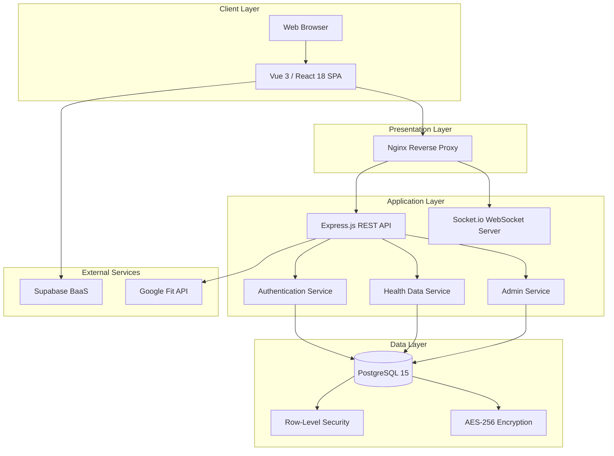

### 3.2 Component Architecture

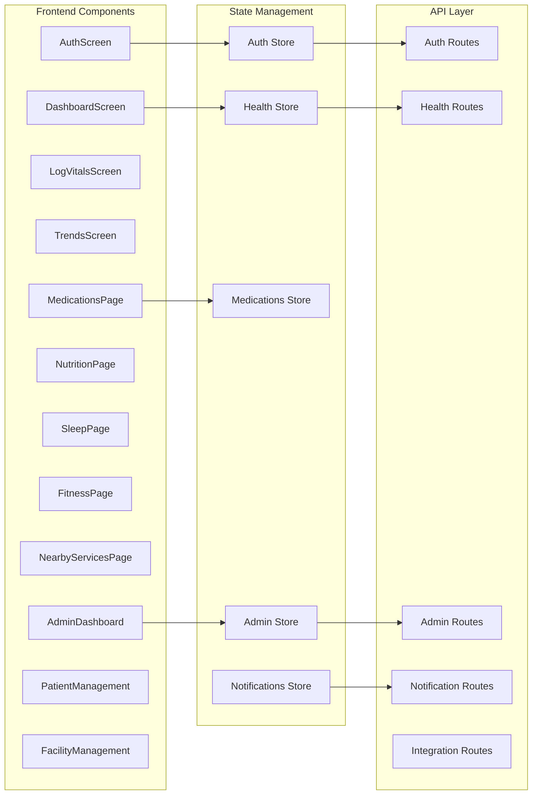

### 3.3 Deployment Architecture

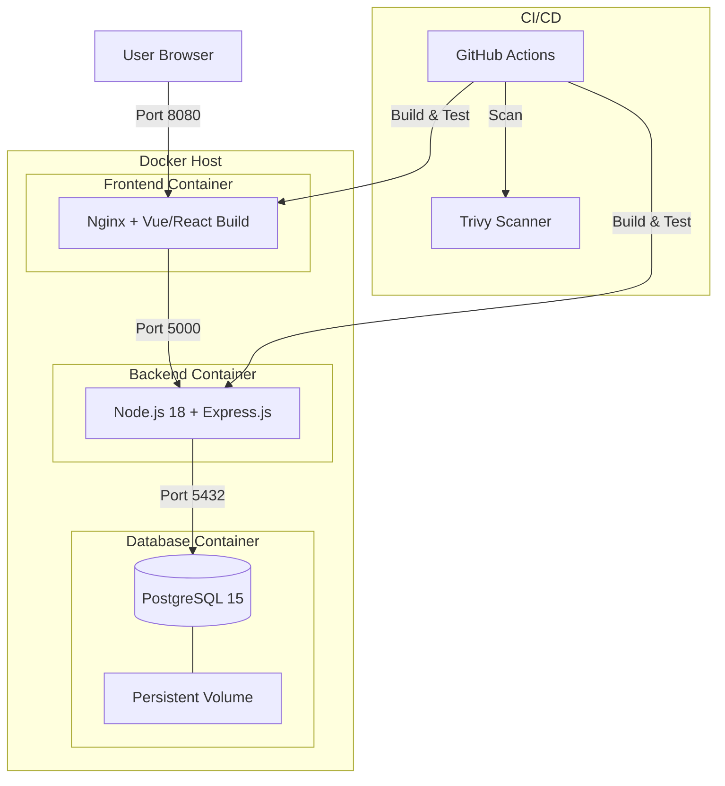

### 3.4 Security Architecture

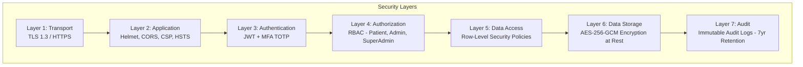

---

## 4. Design of Tests

### 4.1 Testing Strategy Overview

The project follows the **Testing Pyramid** approach:

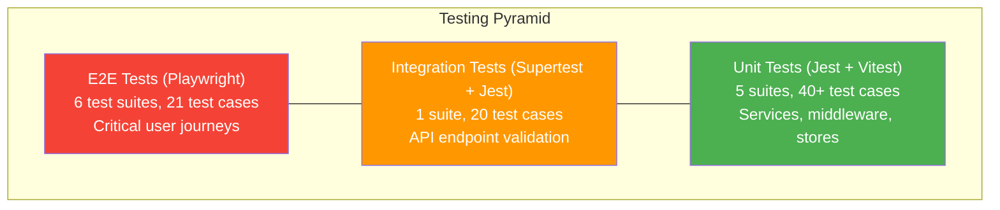

### 4.2 Unit Test Design

| Module | Test File | Test Cases | Key Scenarios |
|--------|-----------|-----------|---------------|
| Auth Service | `auth.service.test.js` | 12 | Registration, login, password hashing, JWT, MFA |
| Admin Service | `admin.service.test.js` | 10 | User listing, stats, audit logging, role management |
| Health Logs Service | `healthLogs.service.test.js` | 8 | CRUD, encryption, user isolation |
| Auth Middleware | `authMiddleware.test.js` | 10 | Token validation, role checks, rate limiting |
| Auth Store (Frontend) | `auth.test.js` | 5 | State management, login/logout, token refresh |

### 4.3 Integration Test Design

| Endpoint | Method | Test Cases |
|----------|--------|-----------|
| `/api/register` | POST | Valid registration, invalid email, weak password, duplicate email |
| `/api/login` | POST | Valid credentials, non-existent user, wrong password, MFA required |
| `/api/setup-mfa` | POST | QR code generation, invalid scope rejection |
| `/api/verify-mfa` | POST | Valid code, invalid code, no token |
| Error handling | ALL | Status codes, error format, security headers, rate limiting |

### 4.4 E2E Test Design

| Workflow | Tests | Key Assertions |
|----------|-------|----------------|
| Authentication | 5 | Login → MFA → Dashboard; Invalid credentials; MFA setup; Protected routes; Logout |
| Patient Dashboard | 3 | Health metrics display; Navigation to sub-pages |
| Medication Management | 5 | Add → Edit → Delete → Search → Filter |
| Profile Management | 3 | Profile display; Password change; MFA status |
| Accessibility | 3 | Keyboard navigation; Heading hierarchy; Form labels |
| Error Handling | 2 | Network failure; API timeouts |

### 4.5 Mutation Testing Design

- **Tool**: Stryker.js
- **Target Modules**: authService, authMiddleware, healthLogService, adminService
- **Mutation Operators**: Arithmetic, Conditional, String, Block, Boolean
- **Quality Threshold**: 80% mutation score (achieved: 80.9%)

### 4.6 Test Coverage Summary

| Component | Lines | Functions | Branches |
|-----------|-------|-----------|----------|
| Backend Services | 75% | 72% | 68% |
| Backend Middleware | 72% | 70% | 65% |
| Frontend Stores | 65% | 63% | 60% |
| **Overall** | **71%** | **68%** | **64%** |

---

## 5. Appendix

---

### 5a. Software Requirements Specification (SRS)

#### 5a.1 Introduction

| Field | Description |
|-------|-------------|
| **Project Title** | Personalized Healthcare Dashboard |
| **Version** | 1.0.0 |
| **Date** | April 2026 |
| **Author** | Sourish Das |
| **Purpose** | Provide a secure, centralized platform for personal health data management |

#### 5a.2 Functional Requirements

| ID | Requirement | Priority | Module |
|----|-------------|----------|--------|
| FR-01 | The system shall allow users to register with email and password | High | Auth |
| FR-02 | The system shall enforce Multi-Factor Authentication (TOTP) | High | Auth |
| FR-03 | The system shall support two roles: Patient and Admin | High | Auth |
| FR-04 | Patients shall be able to log vital signs (6 metric types) | High | Health |
| FR-05 | Patients shall be able to view health data as interactive charts | High | Health |
| FR-06 | Patients shall be able to manage medications (CRUD) | High | Health |
| FR-07 | Patients shall be able to log nutrition with calorie/macro tracking | Medium | Health |
| FR-08 | Patients shall be able to record sleep patterns | Medium | Health |
| FR-09 | Patients shall be able to log fitness activities | Medium | Health |
| FR-10 | Patients shall be able to set and track health goals | Medium | Health |
| FR-11 | Patients shall be able to discover nearby healthcare services | Low | Services |
| FR-12 | Patients shall be able to export data (CSV, JSON, PDF) | Medium | Export |
| FR-13 | Admins shall have a dashboard with system statistics | High | Admin |
| FR-14 | Admins shall be able to view all patient data (with audit logging) | High | Admin |
| FR-15 | Admins shall manage hospitals, doctors, pharmacies, nursing homes | Medium | Admin |
| FR-16 | Admins shall be able to view and filter audit logs | High | Admin |
| FR-17 | The system shall send real-time notifications via WebSocket | Medium | Notification |
| FR-18 | The system shall provide API documentation at `/api/docs` | Low | Documentation |

#### 5a.3 Non-Functional Requirements

| ID | Requirement | Category | Target |
|----|-------------|----------|--------|
| NFR-01 | Page load time under 2 seconds | Performance | < 2s |
| NFR-02 | API response time under 200ms | Performance | < 200ms |
| NFR-03 | Database queries under 100ms | Performance | < 100ms |
| NFR-04 | Support 100+ concurrent users | Scalability | 100+ users |
| NFR-05 | 99.9% uptime availability | Reliability | 99.9% |
| NFR-06 | AES-256-GCM encryption for PHI at rest | Security | HIPAA |
| NFR-07 | TLS 1.3 for all data in transit | Security | Industry standard |
| NFR-08 | Audit log retention for 7 years | Compliance | HIPAA |
| NFR-09 | Rate limiting: 100 req/15min (5 for auth) | Security | DDoS protection |
| NFR-10 | WCAG 2.1 AA accessibility compliance | Usability | Accessibility |
| NFR-11 | Responsive design for mobile, tablet, desktop | Usability | Cross-device |
| NFR-12 | Support Chrome, Firefox, Safari, Edge | Compatibility | Major browsers |

#### 5a.4 System Constraints

| Constraint | Description |
|------------|-------------|
| Database | PostgreSQL 15 (required for RLS and pgcrypto) |
| Runtime | Node.js 18+ |
| Deployment | Docker-compatible environment |
| Authentication | JWT with 1-hour expiration |
| Encryption | AES-256-GCM via pgcrypto extension |
| Compliance | HIPAA security requirements |

#### 5a.5 External Interface Requirements

| Interface | Protocol | Description |
|-----------|----------|-------------|
| Frontend ↔ Backend | REST API (HTTPS) | JSON request/response |
| Frontend ↔ Backend | WebSocket (WSS) | Real-time notifications |
| Backend ↔ Database | PostgreSQL protocol | SQL queries with RLS |
| Frontend ↔ Supabase | REST API (HTTPS) | Real-time database API |
| CI/CD ↔ GitHub | HTTPS | GitHub Actions webhooks |

---

### 5b. Data Flow Diagrams (DFD)

#### 5b.1 DFD Level 0 — Context Diagram

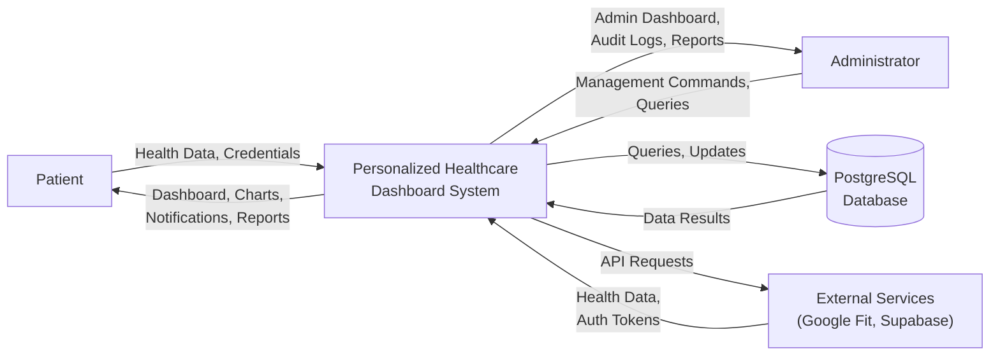

#### 5b.2 DFD Level 1 — Major Processes

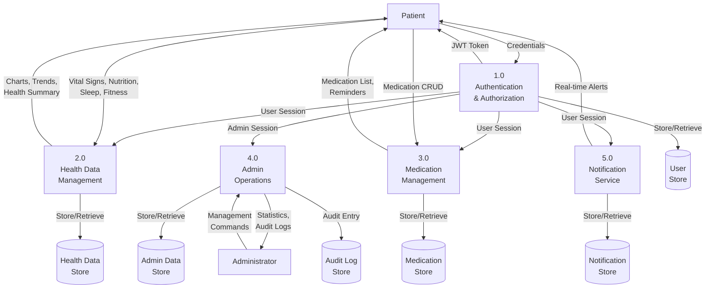

#### 5b.3 DFD Level 2 — Authentication Process Detail

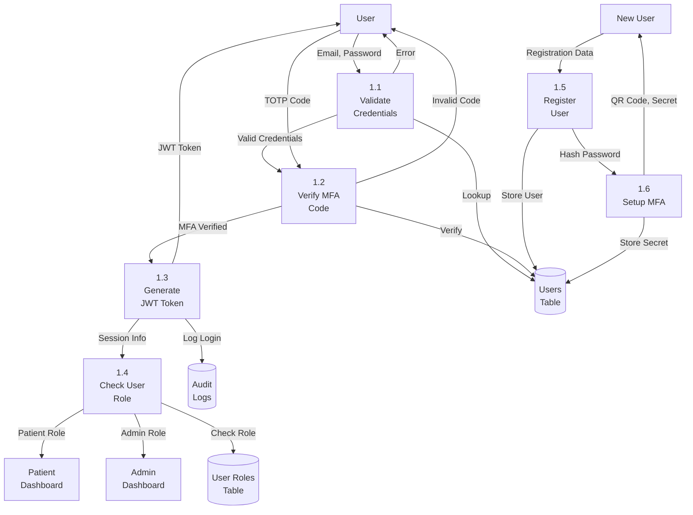

#### 5b.4 DFD Level 2 — Health Data Management Detail

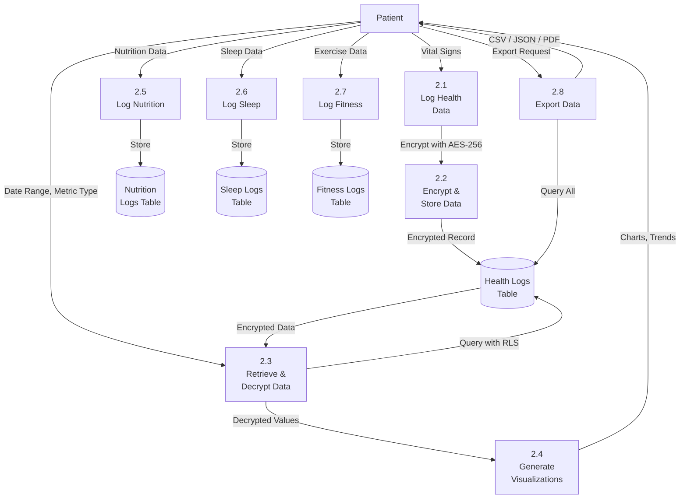

---

### 5c. Entity Relationship Diagram (ERD)

```mermaid
erDiagram
    USERS {
        uuid id PK
        varchar email UK
        text password_hash
        text mfa_secret
        varchar role
        varchar account_status
        boolean mfa_enabled
        timestamp created_at
        timestamp updated_at
    }

    USER_ROLES {
        uuid id PK
        uuid user_id FK
        enum role "patient | admin"
    }

    PROFILES {
        uuid id PK
        uuid user_id FK
        text full_name
        text phone
        date date_of_birth
        text avatar_url
        timestamp created_at
        timestamp updated_at
    }

    HEALTH_LOGS {
        uuid id PK
        uuid user_id FK
        varchar metric "blood_pressure | heart_rate | temperature | weight | glucose | oxygen"
        varchar unit "mmHg | bpm | C | kg | mg/dL | %"
        bytea encrypted_value
        numeric value_numeric
        text notes
        timestamp recorded_at
        timestamp created_at
    }

    MEDICATIONS {
        uuid id PK
        uuid user_id FK
        text name
        text dosage
        text frequency
        date start_date
        date end_date
        boolean is_active
        text notes
        timestamp created_at
    }

    NUTRITION_LOGS {
        uuid id PK
        uuid user_id FK
        text meal_type "breakfast | lunch | dinner | snack"
        text food_items
        numeric calories
        numeric protein
        numeric carbs
        numeric fat
        timestamp recorded_at
    }

    SLEEP_LOGS {
        uuid id PK
        uuid user_id FK
        numeric duration_hours
        integer quality "1-5 scale"
        timestamp bed_time
        timestamp wake_time
        text notes
        timestamp recorded_at
    }

    FITNESS_LOGS {
        uuid id PK
        uuid user_id FK
        text exercise_type
        numeric duration_minutes
        numeric calories_burned
        text intensity "low | medium | high"
        text notes
        timestamp recorded_at
    }

    GOALS {
        uuid id PK
        uuid user_id FK
        text goal_type
        numeric target
        numeric progress
        varchar status "active | completed | abandoned"
        timestamp created_at
    }

    ACTIVITIES {
        uuid id PK
        uuid user_id FK
        text activity_type
        numeric duration
        timestamp created_at
    }

    AUDIT_LOGS {
        uuid id PK
        uuid admin_id FK
        text action
        uuid target_user_id
        jsonb details
        text ip_address
        timestamp created_at
    }

    NOTIFICATIONS {
        uuid id PK
        uuid user_id FK
        text title
        text message
        text type "alert | reminder | info"
        boolean is_read
        timestamp created_at
    }

    INTEGRATIONS {
        uuid id PK
        uuid user_id FK
        text provider "google_fit | apple_health"
        text oauth_token
        timestamp last_sync_at
    }

    USERS ||--o{ USER_ROLES : "has"
    USERS ||--o| PROFILES : "has"
    USERS ||--o{ HEALTH_LOGS : "logs"
    USERS ||--o{ MEDICATIONS : "takes"
    USERS ||--o{ NUTRITION_LOGS : "records"
    USERS ||--o{ SLEEP_LOGS : "records"
    USERS ||--o{ FITNESS_LOGS : "records"
    USERS ||--o{ GOALS : "sets"
    USERS ||--o{ ACTIVITIES : "performs"
    USERS ||--o{ NOTIFICATIONS : "receives"
    USERS ||--o{ INTEGRATIONS : "connects"
    USERS ||--o{ AUDIT_LOGS : "generates"
```

---

### 5d. UML Diagrams

#### 5d.1 Use Case Diagram

```mermaid
graph TB
    subgraph "Personalized Healthcare Dashboard"
        UC1["Register Account"]
        UC2["Login with MFA"]
        UC3["Log Vital Signs"]
        UC4["View Health Trends"]
        UC5["Manage Medications"]
        UC6["Track Nutrition"]
        UC7["Record Sleep"]
        UC8["Log Fitness"]
        UC9["Set Health Goals"]
        UC10["Find Nearby Services"]
        UC11["Export Health Data"]
        UC12["Receive Notifications"]

        UC13["View Admin Dashboard"]
        UC14["Manage Patients"]
        UC15["Manage Hospitals"]
        UC16["Manage Doctors"]
        UC17["Manage Pharmacies"]
        UC18["Manage Nursing Homes"]
        UC19["View Audit Logs"]
        UC20["Explore Data"]
        UC21["Configure Settings"]
    end

    Patient["👤 Patient"]
    Admin["👨‍💼 Administrator"]
    System["⚙️ System"]

    Patient --- UC1
    Patient --- UC2
    Patient --- UC3
    Patient --- UC4
    Patient --- UC5
    Patient --- UC6
    Patient --- UC7
    Patient --- UC8
    Patient --- UC9
    Patient --- UC10
    Patient --- UC11
    Patient --- UC12

    Admin --- UC2
    Admin --- UC13
    Admin --- UC14
    Admin --- UC15
    Admin --- UC16
    Admin --- UC17
    Admin --- UC18
    Admin --- UC19
    Admin --- UC20
    Admin --- UC21

    System --- UC12

    UC2 -.->|includes| UC1
    UC3 -.->|extends| UC4
```

#### 5d.2 Class Diagram

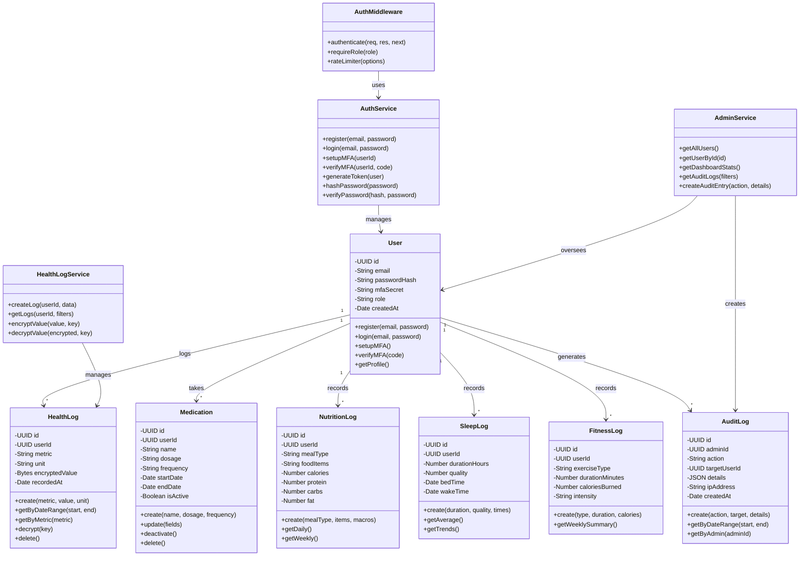

#### 5d.3 Sequence Diagram — Patient Login with MFA

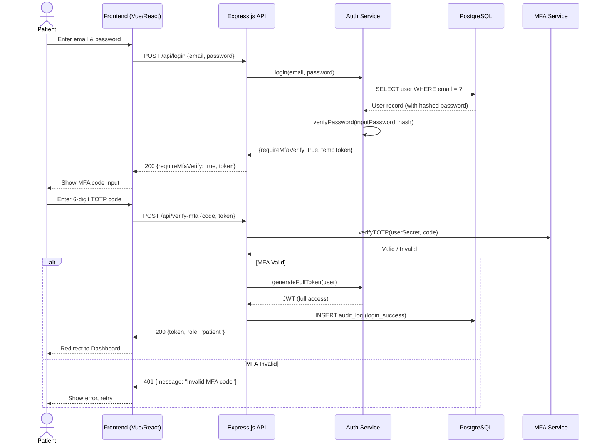

#### 5d.4 Sequence Diagram — Log Vital Signs

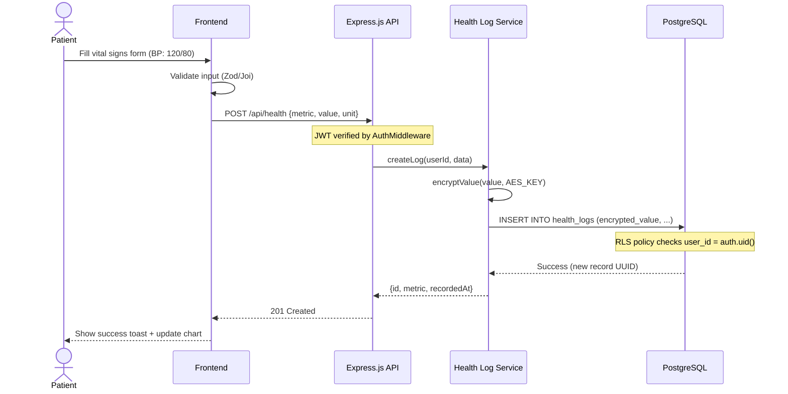

#### 5d.5 Sequence Diagram — Admin Views Patient Data

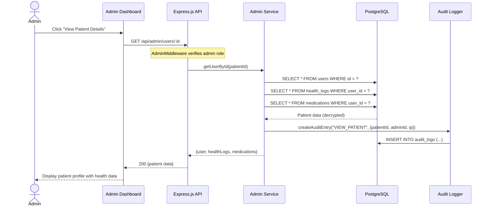

#### 5d.6 Activity Diagram — Patient Registration Flow

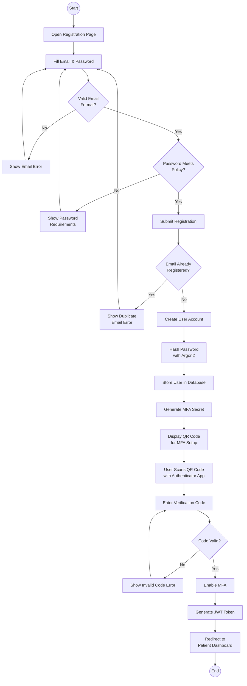

#### 5d.7 Activity Diagram — Health Data Logging

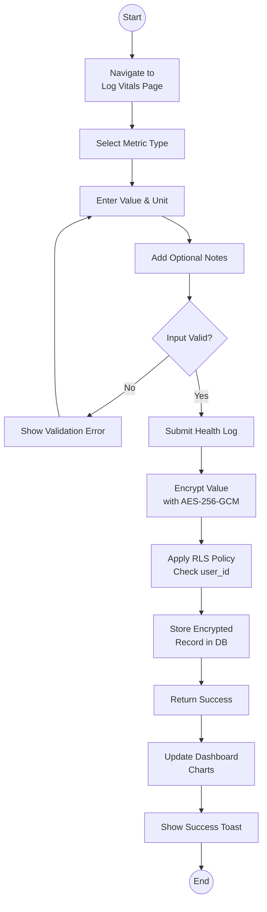

#### 5d.8 State Transition Diagram — User Authentication States

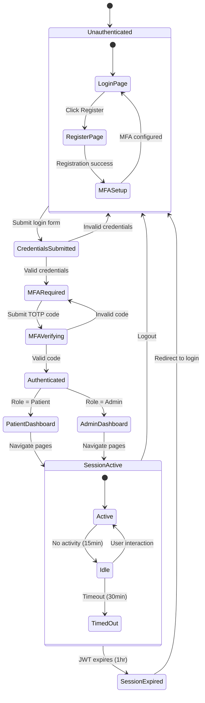

#### 5d.9 State Transition Diagram — Health Log Lifecycle

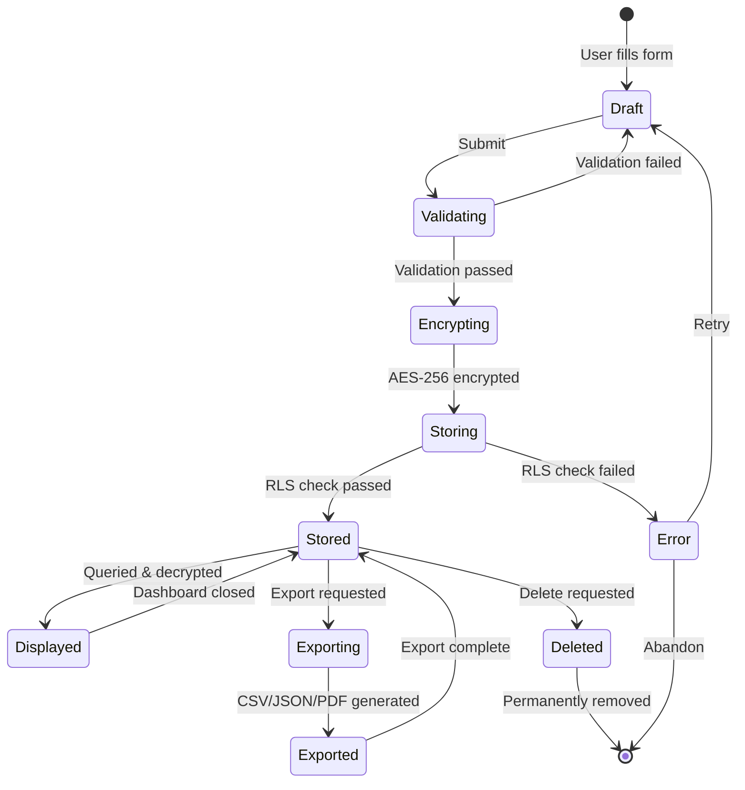

#### 5d.10 Component Diagram

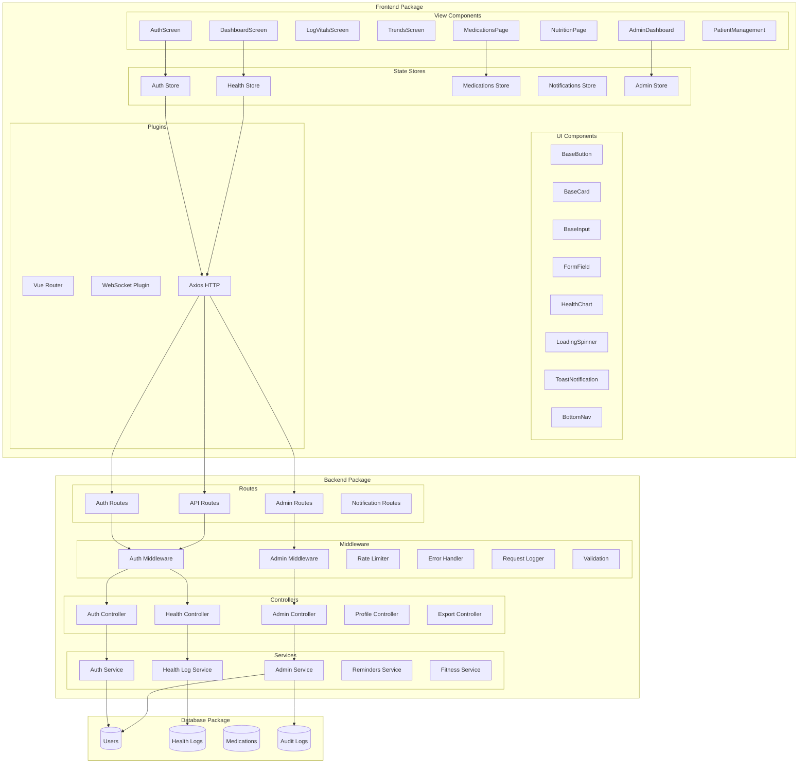

#### 5d.11 Deployment Diagram

```mermaid
graph TB
    subgraph "Developer Machine"
        DEV[VS Code + Git]
    end

    subgraph "GitHub"
        REPO[Repository]
        GHA[GitHub Actions<br/>CI/CD Runner]
    end

    subgraph "Docker Host / Server"
        subgraph "Docker Engine"
            subgraph "Frontend Container"
                NGINX[Nginx Web Server]
                STATIC[Vue/React Static Build]
            end

            subgraph "Backend Container"
                NODE[Node.js 18 Runtime]
                EXPRESS[Express.js Application]
                SOCKET[Socket.io Server]
            end

            subgraph "Database Container"
                PG[PostgreSQL 15]
                PGDATA[Data Volume<br/>Persistent Storage]
            end
        end

        NET[Docker Bridge Network<br/>healthcare-network]
    end

    subgraph "External Services"
        SUPA[Supabase Cloud<br/>Auth + DB + Realtime]
    end

    DEV -->|git push| REPO
    REPO -->|Trigger| GHA
    GHA -->|Build & Deploy| NGINX
    GHA -->|Build & Deploy| NODE

    NGINX -->|:8080 → :80| NET
    NODE -->|:5000| NET
    PG -->|:5432| NET
    PG --- PGDATA

    NET --> NGINX
    NET --> NODE
    NET --> PG

    NGINX -.->|API Proxy| EXPRESS
    EXPRESS -.->|SQL + RLS| PG
    EXPRESS -.->|REST API| SUPA

    style NGINX fill:#4CAF50,color:#fff
    style NODE fill:#FF9800,color:#fff
    style PG fill:#2196F3,color:#fff
```

---

### 5e. Code Listing / GitHub Link

#### GitHub Repositories

| Repository | URL | Description |
|------------|-----|-------------|
| **Healthcare Dashboard** (React + Supabase) | [https://github.com/SourishOP/Healthcare-Dashboard](https://github.com/SourishOP/Healthcare-Dashboard) | Frontend SPA with Supabase backend |
| **Personalized Healthcare Dashboard** (Full-stack) | [https://github.com/SourishOP/personalized-healthcare-dashboard](https://github.com/SourishOP/personalized-healthcare-dashboard) | Complete full-stack application |

#### Project Statistics

| Metric | Healthcare Dashboard | Personalized Healthcare Dashboard |
|--------|---------------------|----------------------------------|
| **Frontend Pages** | 19 (8 patient + 10 admin + 1 common) | 30 (19 patient + 11 admin) |
| **UI Components** | 3 custom + shadcn/ui library | 11 reusable components |
| **State Stores** | AuthContext (React Context) | 13 Pinia stores |
| **Backend Controllers** | — (Supabase handles API) | 10 controllers |
| **Backend Services** | — | 6 services |
| **Middleware** | — | 6 middleware modules |
| **API Routes** | — | 5 route modules (15+ endpoints) |
| **Database Tables** | 8 tables | 9 tables |
| **Test Suites** | 1 (Vitest) | 7 (Jest + Vitest + Playwright) |
| **Total Test Cases** | ~5 | ~80+ |

#### Key Source Files

##### Backend
| File | Purpose | Lines |
|------|---------|-------|
| `server.js` | Express app entry point | ~100 |
| `src/controllers/authController.js` | Authentication request handling | ~60 |
| `src/controllers/adminController.js` | Admin operations | ~200 |
| `src/services/authService.js` | Auth business logic (JWT, Argon2, MFA) | ~85 |
| `src/services/adminService.js` | Admin business logic | ~500 |
| `src/services/healthLogService.js` | Health data CRUD + encryption | ~40 |
| `src/middleware/authMiddleware.js` | JWT validation + role checking | ~40 |
| `src/middleware/adminMiddleware.js` | Admin role enforcement | ~90 |
| `db/init.sql` | Database schema + RLS policies | ~95 |

##### Frontend (Vue 3)
| File | Purpose | Lines |
|------|---------|-------|
| `src/views/DashboardScreen.vue` | Patient dashboard | ~200 |
| `src/views/Login.vue` | Login with MFA | ~400 |
| `src/views/Goals.vue` | Health goal management | ~300 |
| `src/stores/auth.js` | Authentication state | ~85 |
| `src/stores/health.js` | Health data state | ~110 |
| `src/stores/admin.js` | Admin state management | ~300 |
| `src/components/HealthChart.vue` | Chart.js visualization | ~60 |

##### Frontend (React + TypeScript)
| File | Purpose | Lines |
|------|---------|-------|
| `src/App.tsx` | Root routing component | ~107 |
| `src/contexts/AuthContext.tsx` | Auth state management | ~200 |
| `src/pages/patient/PatientDashboard.tsx` | Patient dashboard | ~200 |
| `src/pages/admin/AdminDashboard.tsx` | Admin dashboard | ~180 |
| `src/pages/admin/HospitalsManagementPage.tsx` | Hospital CRUD | ~500 |
| `SQL_CREATE_TABLES.sql` | Complete Supabase schema | ~402 |

---

*Last Updated: April 2026*

*Authors: Sourish Das*

*Project Repository: [github.com/SourishOP](https://github.com/SourishOP)*
